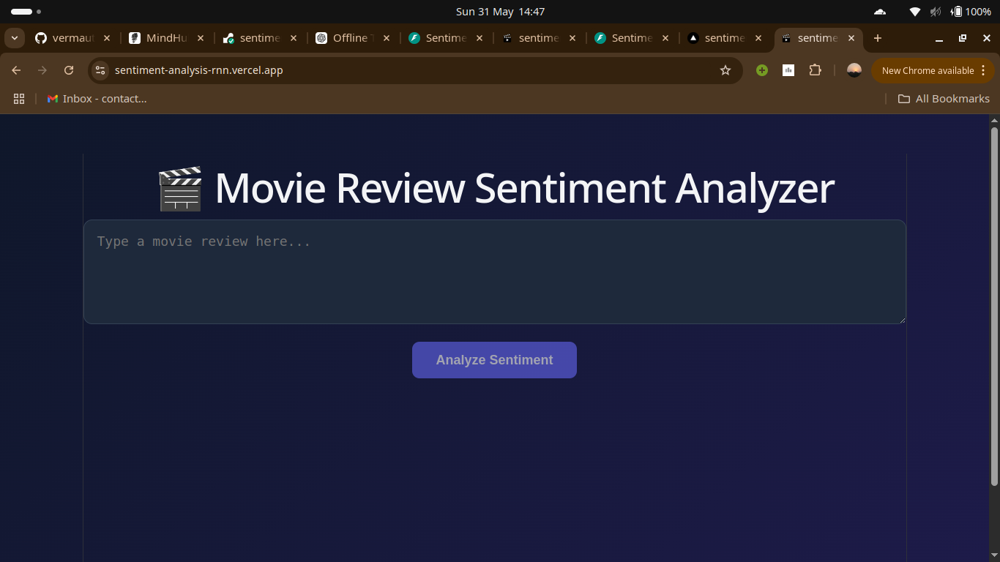
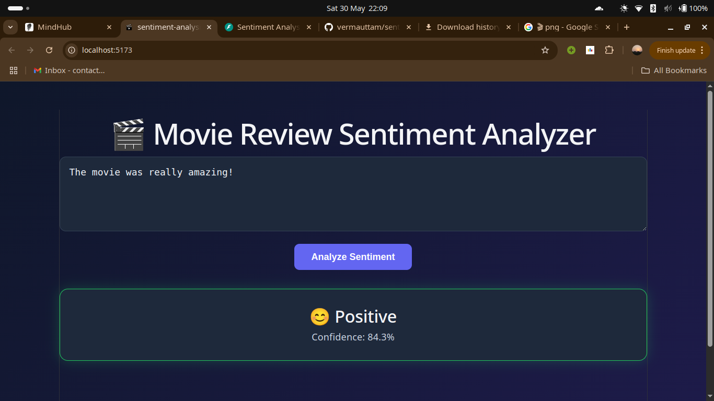
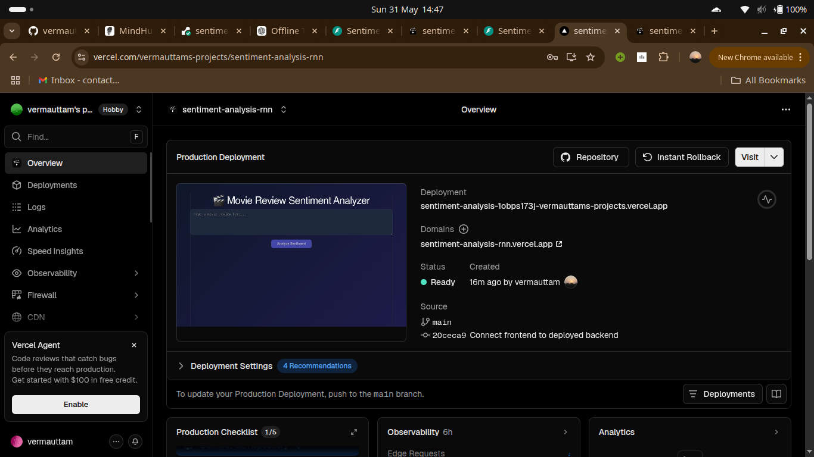

# Sentiment Analysis using RNN

A full-stack sentiment analysis application built using PyTorch, FastAPI, and React.

The project classifies movie reviews as **Positive** or **Negative** using a Recurrent Neural Network (RNN) trained on the IMDB Movie Reviews dataset. The trained model is exposed through a FastAPI backend and consumed by a React frontend where users can enter reviews and receive predictions along with confidence scores.

---

---

## Live Demo

**Live App:** https://sentiment-analysis-rnn.vercel.app

**Backend API:** https://sentiment-analysis-rnn-znj0.onrender.com

> **Note:** The backend is hosted on Render free tier, so the first prediction may take a few seconds due to cold start. Later predictions are faster.


## Project Overview

The main objective of this project was to understand the complete machine learning workflow:

* Data preprocessing
* Feature extraction using TF-IDF
* Training an RNN model in PyTorch
* Saving and loading trained models
* Building an API for inference
* Connecting a frontend application to the backend
* Deploying a trained model in a usable application

Instead of stopping at model training inside a notebook, this project focuses on taking the model through the entire pipeline and making it accessible through a web interface.

---

## Features

* Binary sentiment classification
* Text preprocessing before prediction
* TF-IDF based feature extraction
* PyTorch RNN model
* FastAPI REST API
* React frontend built with Vite
* Confidence score display
* Dark-themed user interface
* Modular project structure

---

## Tech Stack

### Machine Learning

* Python
* PyTorch
* Scikit-learn
* Pandas
* NumPy

### Backend

* FastAPI
* Uvicorn

### Frontend

* React
* Vite
* Axios
* CSS

### Dataset

* IMDB Movie Reviews Dataset

---

## Project Structure

```text
sentiment-analysis-rnn/
│
├── backend/
│   ├── saved_models/
│   │   ├── rnn_model.pth
│   │   ├── tfidf.pkl
│   │   └── label_encoder.pkl
│   │
│   ├── app.py
│   ├── config.py
│   ├── model.py
│   ├── predict.py
│   ├── preprocess.py
│   ├── test.py
│   └── requirements.txt
│
├── frontend/
│   ├── public/
│   │   └── favicon.png
│   │
│   ├── src/
│   │   ├── components/
│   │   │   └── ResultCard.jsx
│   │   ├── pages/
│   │   │   └── Home.jsx
│   │   ├── services/
│   │   ├── App.jsx
│   │   ├── App.css
│   │   ├── index.css
│   │   └── main.jsx
│   │
│   ├── index.html
│   ├── package.json
│   ├── vite.config.js
│   └── .gitignore
│
├── notebook/
│   ├── saved_models/
│   │   ├── rnn_model.pth
│   │   ├── tfidf.pkl
│   │   └── label_encoder.pkl
│   │
│   ├── IMDB Dataset.csv
│   └── RNN_for_sentimentanalysis.ipynb
│
├── screenshots/
├── .gitignore
└── README.md
```

---

## Model Training Workflow

### 1. Data Loading

The IMDB Movie Reviews dataset is loaded into a Pandas DataFrame for processing and training.

### 2. Text Preprocessing

Each review is cleaned before feature extraction.

The preprocessing pipeline includes:

* Converting text to lowercase
* Removing HTML tags
* Removing punctuation
* Removing special characters
* Removing extra whitespace

The same preprocessing logic is used during both training and inference to maintain consistency.

### 3. Feature Extraction

TF-IDF Vectorization is used to convert reviews into numerical features.

Configuration:

```python
max_features = 5000
```

The fitted vectorizer is saved as:

```text
tfidf.pkl
```

and reused during prediction.

### 4. Label Encoding

Sentiment labels are encoded and stored using:

```text
label_encoder.pkl
```

### 5. Model Training

The transformed feature vectors are used to train a Recurrent Neural Network implemented in PyTorch.

The trained model weights are saved as:

```text
rnn_model.pth
```

---

## Backend

The backend is built using FastAPI and handles all prediction requests.

### Endpoint

```http
POST /predict
```

### Sample Request

```json
{
  "text": "This movie was fantastic and enjoyable."
}
```

### Sample Response

```json
{
  "sentiment": "positive",
  "confidence": 0.96
}
```

---

## Frontend

The frontend is built using React and Vite.

Users can:

* Enter a review
* Submit it for analysis
* View the predicted sentiment
* View the model confidence score

The result card changes appearance depending on whether the prediction is positive or negative.

---

## Screenshots

### Home Page



### Positive Prediction



### Negative Prediction


### Live Deployed App


---

## Setup Instructions

### Clone the Repository

```bash
git clone https://github.com/your-username/sentiment-analysis-rnn.git
cd sentiment-analysis-rnn
```

---

## Backend Setup

Create and activate a virtual environment.

Linux:

```bash
python3 -m venv myenv
source myenv/bin/activate
```

Windows:

```bash
python -m venv myenv
myenv\Scripts\activate
```

Install dependencies:

```bash
cd backend
pip install -r requirements.txt
```

Start the FastAPI server:

```bash
uvicorn app:app --reload
```

Backend URL:

```text
http://localhost:8000
```

Swagger Documentation:

```text
http://localhost:8000/docs
```

---

## Frontend Setup

Open a new terminal and run:

```bash
cd frontend
npm install
npm run dev
```

Frontend URL:

```text
http://localhost:5173
```

---

## Running the Application

1. Start the backend server.
2. Start the frontend server.
3. Open the frontend in a browser.
4. Enter a movie review.
5. Click the Analyze button.
6. View the prediction and confidence score.

---

## Example Predictions

### Positive Review

Input:

```text
The acting was excellent and the story kept me engaged throughout.
```

Output:

```text
Positive
Confidence: 97%
```

### Negative Review

Input:

```text
The movie was boring and felt unnecessarily long.
```

Output:

```text
Negative
Confidence: 95%
```

---

## Challenges Faced

Some challenges encountered during development included:

* Converting TF-IDF output into a format suitable for the RNN model.
* Keeping preprocessing consistent between training and inference.
* Managing model loading and prediction logic separately from the API layer.
* Handling communication between the React frontend and FastAPI backend.
* Organizing notebook code into reusable backend modules.

---

## Limitations

* The model is trained only on English movie reviews.
* Predictions may be less accurate for text significantly different from the training dataset.
* The application currently supports only binary sentiment classification.
* TF-IDF features do not capture contextual meaning as effectively as transformer-based models.

---

## Future Improvements

Possible future enhancements include:

* Replacing the RNN with LSTM or GRU architectures.
* Adding model evaluation dashboards.
* Supporting batch predictions.
* Containerizing the application using Docker.
* Improving backend cold start time.
* Experimenting with transformer-based models such as BERT.

---

## Author

**Uttam Verma**

B.Tech C.S.E Student

This project was developed as part of learning and implementing an end-to-end machine learning application, covering model training, backend development, and frontend integration.
